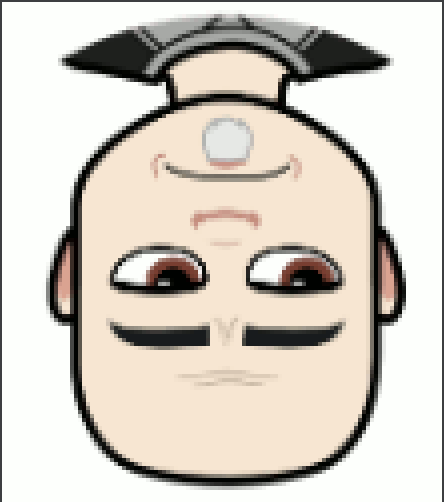
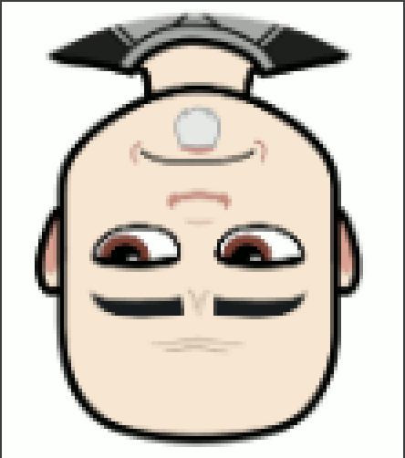
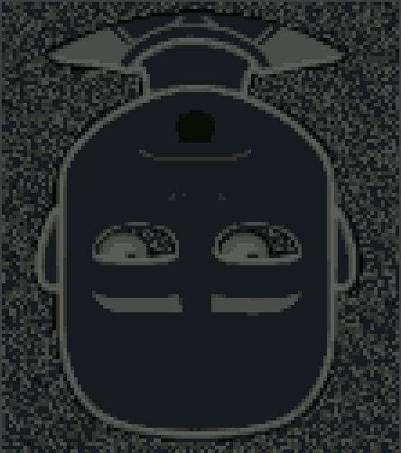
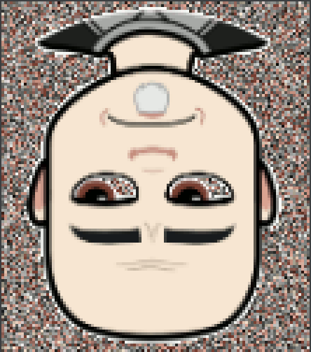

# Bitmap Transformer

A Java application that transforms a provided bitmap image, `name.bmp`, into several variants. It can be run from the command line by providing the name of the file to be transformed (which must be located in the `resources` folder), the name of new bitmap file (name.bmp), plus two additional arguments depending on the transform. There are four available `transform` variants: `grayscale`, `invert`, `random`, and `flip`. The `flip` variant has two `types`: `horizontal` and `vertical`. The type for the other three variants is `none`.

To run the application, clone the repo and (with Gradle) run `./gradlew run --args "<inputname>.bmp <outputname>.bmp <variant> <type>"`. The `Bitmap Transformer` comes preloaded with `baldy-8bit.bmp` and several examples of already completed transforms.

The base bmp file, `baldy-8bit.bmp`, is: 

Using `./gradlew run --args "baldy-8bit.bmp invert.bmp invert none"`

Using `./gradlew run --args "baldy-8bit.bmp grayscale.bmp grayscale none"`

Using `./gradlew run --args "baldy-8bit.bmp random.bmp random none"`

Using `./gradlew run --args "baldy-8bit.bmp fliphorizontal.bmp flip horizontal"`

Using `./gradlew run --args "baldy-8bit.bmp flipvertical.bmp flip vertical"`

Using `./gradlew run --args "baldy-8bit.bmp fliphorizontal.bmp flip horizontal"` and then `./gradlew run --args "fliphorizontal.bmp fliphandv.bmp flip vertical"`. Notice that this file required two transforms. The output of the first transform in the input of the second transform.

You can continue to stack transforms. Try to guess what transforms were required to create these outputs:

